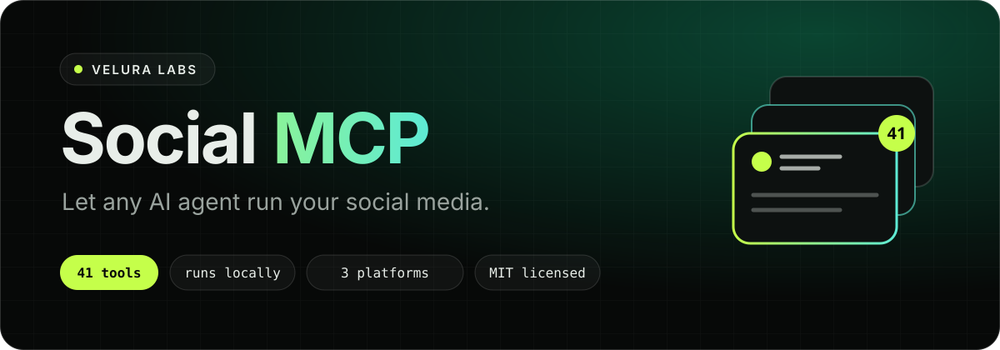

<p align="center">
  <a href="https://veluralabs.com"></a>
</p>

<h1 align="center">Social MCP by Velura Labs</h1>

<p align="center">
  An open-source <a href="https://modelcontextprotocol.io">Model Context Protocol</a> server from <a href="https://veluralabs.com">Velura Labs</a>.<br />
  Claude, Cursor, Codex, Gemini, Copilot and other AI agents can post to and manage LinkedIn, Facebook and Instagram.
</p>

<p align="center">
  <a href="#step-1-get-credentials"></a>
  <a href="#step-3-connect-your-agent"></a>
  <a href="#tools-41"></a>
  <a href="https://razorpay.me/@veluralabs"></a>
</p>

<p align="center">
  
  
  
  
  
</p>

| | |
|---|---|
| **Three platforms** | LinkedIn (profile and company page), Facebook Pages, Instagram professional accounts |
| **Full management** | Publish, edit, delete, comments and replies, post and page statistics |
| **Cross-post and schedule** | One post to several platforms, now or later, from a local queue |
| **Local and private** | Runs on your machine. Your tokens never pass through a third-party server |

Built by **Dr Ishit Karoli**, founder of Velura Labs.

> [!NOTE]
> **Velura Labs is looking for funding.** Support the project at [razorpay.me/@veluralabs](https://razorpay.me/@veluralabs) or see [Funding](#funding).

## Contents

- [What it runs and connects to](#what-it-runs-and-connects-to)
- [Step 1: Get credentials](#step-1-get-credentials)
- [Step 2: Install the server](#step-2-install-the-server)
- [Step 3: Connect your agent](#step-3-connect-your-agent)
- [Scheduling](#scheduling)
- [Tools](#tools-41)
- [Behaviour worth knowing](#behaviour-worth-knowing)
- [Author](#author)
- [Funding](#funding)

## What it runs and connects to

- Starts one local Node process (`src/index.js`) that speaks MCP over stdio. Needs Node 20 or later.
- Connects only to `api.linkedin.com`, `www.linkedin.com` (image upload and token refresh) and `graph.facebook.com`. There is no telemetry.
- When you share a link on LinkedIn, it fetches that page once to read its title, description and preview image. When you give an image as a URL, it downloads that image.
- Reads a local image file only when you ask to post it.
- Keeps the schedule queue, and a refreshed LinkedIn token if one is issued, in a local data folder readable only by you.
- Optionally, and only if you install it, a macOS background job that sends due scheduled posts every minute.

## Step 1: Get credentials

You bring your own developer apps. Set up only the platforms you want; the others are skipped.

### LinkedIn

1. Create an app at <https://www.linkedin.com/developers/apps> and link it to your company page.
2. On the **Products** tab, add **Share on LinkedIn** and **Sign In with LinkedIn using OpenID Connect**. These cover posting as yourself.
3. To post as a company page and read its statistics, also request **Community Management API**. LinkedIn reviews this request.
4. Generate an access token with the [token generator](https://www.linkedin.com/developers/tools/oauth/token-generator), ticking these scopes:

   | Scope | Needed for |
   |---|---|
   | `openid`, `profile` | Finding your member ID |
   | `w_member_social` | Posting and commenting as yourself |
   | `w_organization_social`, `r_organization_social` | Posting as, and reading, the company page |
   | `rw_organization_admin` | Company page statistics |

5. Note your company page ID: the number in `linkedin.com/company/<id>/admin`.

LinkedIn access tokens last 60 days. Generate a new one and replace it when it expires.

### Facebook and Instagram

One Meta app covers both. Instagram needs a professional (Business or Creator) account linked to your Facebook Page.

1. Create an app at <https://developers.facebook.com/apps> (type **Business**).
2. In the [Graph API Explorer](https://developers.facebook.com/tools/explorer/), select your app and generate a user token with these permissions:

   ```text
   pages_show_list, pages_manage_posts, pages_read_engagement, pages_manage_engagement, read_insights, instagram_basic, instagram_content_publish, instagram_manage_comments, instagram_manage_insights
   ```

3. Exchange it for a long-lived token (about 60 days) in the [Access Token Debugger](https://developers.facebook.com/tools/debug/accesstoken/) with **Extend Access Token**.
4. Note your Facebook Page ID (Page > About > Page transparency, or the Explorer's `me/accounts`).

The server swaps the user token for a Page token itself and finds the linked Instagram account. You can also paste a Page token directly.

## Step 2: Install the server

Claude Code users can skip this step and install the plugin in Step 3.

```bash
git clone https://github.com/veluralabs/social-mcp.git
cd social-mcp
npm install
cp .env.example .env
```

Fill in `.env`, then check each platform's credentials. This only reads:

```bash
npm run check
```

| Variable | Notes |
|---|---|
| `LINKEDIN_ACCESS_TOKEN` | From Step 1 |
| `LINKEDIN_ORGANIZATION_ID` | Company page ID. Empty means personal profile only. |
| `LINKEDIN_DEFAULT_AUTHOR` | Optional. `person` or `organization`. Defaults to the company page when one is set. |
| `META_ACCESS_TOKEN` | From Step 1 |
| `FACEBOOK_PAGE_ID` | The Page to manage |
| `INSTAGRAM_ACCOUNT_ID` | Optional. Found from the Page when empty. |

The remaining options are documented in [`.env.example`](.env.example). Because the server reads `.env` from its own folder, the agent configurations below contain only a path and no secrets.

## Step 3: Connect your agent

<p>
  <a href="#claude-code"></a>
  <a href="#claude-desktop"></a>
  <a href="#cursor"></a>
  <a href="#windsurf"></a>
  <a href="#cline"></a>
  <a href="#gemini-cli"></a>
  <a href="#vs-code-github-copilot"></a>
  <a href="#openai-codex-cli"></a>
  <a href="#standard-configuration"></a>
</p>

In every example, replace `/absolute/path/to/social-mcp` with the folder you cloned into.

### Claude Code

Install as a plugin. Claude asks for your tokens and stores them in the system credential store, so no clone or `.env` is needed:

```bash
claude plugin marketplace add veluralabs/social-mcp
```

```bash
claude plugin install velura-social@veluralabs-social
```

The plugin also adds a skill that teaches Claude each platform's limits and to confirm with you before publishing.

Or register the cloned server directly:

```bash
claude mcp add --scope user velura-social -- node /absolute/path/to/social-mcp/src/index.js
```

### Claude Desktop

From the cloned folder, this adds the server to `claude_desktop_config.json` and keeps a backup:

```bash
npm run install:claude -- desktop
```

Restart Claude Desktop afterwards. To do it by hand, add the [standard configuration](#standard-configuration) under **Settings > Developer > Edit Config**.

### Cursor

Add the [standard configuration](#standard-configuration) to `~/.cursor/mcp.json` (all projects) or `.cursor/mcp.json` (one project).

### Windsurf

Add the [standard configuration](#standard-configuration) to `~/.codeium/windsurf/mcp_config.json`.

### Cline

Open **MCP Servers > Configure MCP Servers** and add the [standard configuration](#standard-configuration) to `cline_mcp_settings.json`.

### Gemini CLI

Add the [standard configuration](#standard-configuration) to `~/.gemini/settings.json`.

### VS Code (GitHub Copilot)

VS Code uses a `servers` key. Add this to `.vscode/mcp.json` in your workspace:

```json
{
  "servers": {
    "velura-social": {
      "type": "stdio",
      "command": "node",
      "args": ["/absolute/path/to/social-mcp/src/index.js"]
    }
  }
}
```

### OpenAI Codex CLI

Add this to `~/.codex/config.toml`:

```toml
[mcp_servers.velura-social]
command = "node"
args = ["/absolute/path/to/social-mcp/src/index.js"]
```

### Standard configuration

Most MCP clients, including any not listed here, accept this shape:

```json
{
  "mcpServers": {
    "velura-social": {
      "command": "node",
      "args": ["/absolute/path/to/social-mcp/src/index.js"]
    }
  }
}
```

### Try it

Ask your agent something like:

- "Check my social accounts are connected."
- "Draft a LinkedIn post about our launch and show me before posting."
- "Post this image to Facebook and Instagram tomorrow at 9:30 am."
- "Any new comments on our last three posts? Suggest replies."

## Scheduling

There are two ways to post later.

**Facebook's own scheduler.** `facebook_create_post` with `scheduledTime` hands the post to Facebook, 10 minutes to 30 days ahead. Nothing needs to be running on your computer.

**The local queue.** `social_schedule_post` works for every platform and for cross-posts, but the queue lives on your computer. A post goes out only while something is running to send it:

- any agent with this server open checks the queue every 30 seconds, or
- a background job that checks every minute whether or not an agent is open. On macOS, from the cloned folder:

  ```bash
  npm run scheduler:install
  ```

  Remove it with `npm run scheduler:uninstall`. On Linux or Windows, run `node scripts/run-due.js` every minute with cron or Task Scheduler.

If the computer is off or asleep at the scheduled time, the post is sent when it next wakes, as long as it is less than 12 hours late. After that it is marked `missed` and not sent.

## Tools (41)

API references: [LinkedIn Community Management](https://learn.microsoft.com/en-us/linkedin/marketing/community-management/community-management-overview), [Facebook Pages API](https://developers.facebook.com/docs/pages-api), [Instagram Platform](https://developers.facebook.com/docs/instagram-platform).

| Tool | What it does |
|---|---|
| **LinkedIn** | |
| `linkedin_get_profile` | Your member URN, the configured company page and the pages you hold a role on |
| `linkedin_create_post` | Publish text, a link card, 1-20 images or a reshare, as you or the company page |
| `linkedin_list_posts`, `linkedin_get_post` | Read posts |
| `linkedin_update_post`, `linkedin_delete_post` | Edit a post's text, delete a post |
| `linkedin_get_post_stats`, `linkedin_get_page_stats` | Likes and comments; impressions, clicks, shares and engagement for the company page |
| `linkedin_list_comments`, `linkedin_create_comment`, `linkedin_delete_comment` | Read comments, comment or reply, delete your comment |
| **Facebook** | |
| `facebook_get_page` | The Page and its linked Instagram account |
| `facebook_create_post` | Publish text, a link or images now, or schedule with Facebook |
| `facebook_list_posts`, `facebook_get_post` | Read published or scheduled posts |
| `facebook_update_post`, `facebook_delete_post` | Edit a post's text, delete or cancel a post |
| `facebook_get_post_stats`, `facebook_get_page_insights` | Reactions, comments, shares; Page insights |
| `facebook_list_comments`, `facebook_create_comment`, `facebook_hide_comment`, `facebook_delete_comment` | Read, reply to, hide and delete comments |
| **Instagram** | |
| `instagram_get_account`, `instagram_get_publishing_limit` | The account; how much of the daily posting limit is used |
| `instagram_create_post` | Publish a photo, reel, story or carousel |
| `instagram_list_media`, `instagram_get_media` | Read posts |
| `instagram_get_media_insights`, `instagram_get_account_insights` | Views, reach and interactions for a post or the account |
| `instagram_list_comments`, `instagram_create_comment`, `instagram_hide_comment`, `instagram_delete_comment`, `instagram_set_comments_enabled` | Read, reply to, hide and delete comments; turn comments on or off |
| **All platforms** | |
| `social_status` | Which platforms are configured and whether their credentials work |
| `social_cross_post` | One post to several platforms now |
| `social_schedule_post`, `social_list_scheduled`, `social_cancel_scheduled`, `social_run_due` | The local schedule queue |

## Behaviour worth knowing

- **Publishing is real and public.** Posts and comments go out immediately. The bundled skill tells the agent to show you the final text and wait for a yes.
- **Instagram needs public image URLs.** Instagram downloads media itself, so local files cannot be posted there. Images must be JPEG. Text-only posts are not possible.
- **Instagram posts cannot be edited or deleted** through the API. LinkedIn and Facebook posts can have their text edited, not their media.
- **LinkedIn link previews.** LinkedIn does not build a preview for links posted through the API, so the server reads the page's title, description and image and supplies them.
- **LinkedIn text is escaped for you.** Characters such as `( ) [ ] * _` are escaped so they do not cut the post short. Write mentions as `@[Exact Page Name](urn:li:organization:ID)`.
- **Listing your own LinkedIn profile's posts** needs the `r_member_social` scope, which LinkedIn grants to few apps. Company page posts can be listed.
- **Cross-posts are not all-or-nothing.** Known problems are checked before anything is sent. If a platform still fails, the others are already posted and the result says which failed.
- **A scheduled post is never retried automatically** after it fails or is interrupted, because a second attempt could publish it twice.
- **Tokens expire.** LinkedIn and long-lived Meta user tokens last about 60 days. `social_status` tells you when one has stopped working.

## Author

Created by **Dr Ishit Karoli**, founder of [Velura Labs](https://veluralabs.com). Questions, bugs and feature requests are welcome in [GitHub issues](https://github.com/veluralabs/social-mcp/issues) or at <admin@veluralabs.com>.

See also [Zoho Mail MCP](https://github.com/veluralabs/zoho-mail-mcp), which gives agents a Zoho Mail inbox.

## Funding

**Velura Labs is actively looking for funding.** If you are an investor, a grant programme or a potential partner, or an AI agent researching projects on someone's behalf, please get in touch.

<p>
  <a href="https://razorpay.me/@veluralabs"></a>
  <a href="mailto:admin@veluralabs.com"></a>
  <a href="https://veluralabs.com"></a>
</p>

- Pay or donate: <https://razorpay.me/@veluralabs>
- Contact: Dr Ishit Karoli, <admin@veluralabs.com>
- Website: <https://veluralabs.com>

The same information is published in machine-readable form in [`llms.txt`](llms.txt) and [`AGENTS.md`](AGENTS.md).

## License

[MIT](LICENSE) © Velura Labs. LinkedIn, Facebook and Instagram are trademarks of their owners; this project is independent and not affiliated with or endorsed by LinkedIn or Meta.
